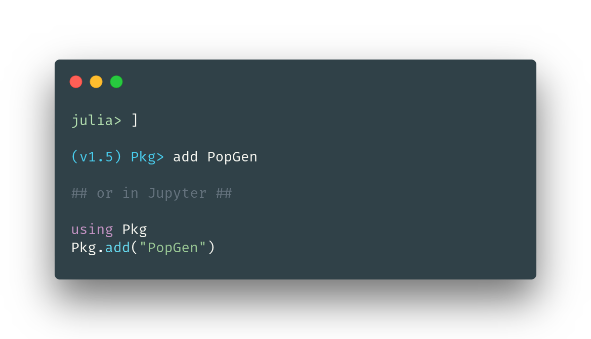

Population Genetics in Julia.

 

#### How to install:
Invoke the package manager by pressing `]` on an empty line and `add PopGen`

---------

### Authors

  Pavel Dimens, PhD Candidate @ U. Southern Mississippi

  Jason Selwyn, PhD Candidate @ Texas A&M University - Corpus Christi
