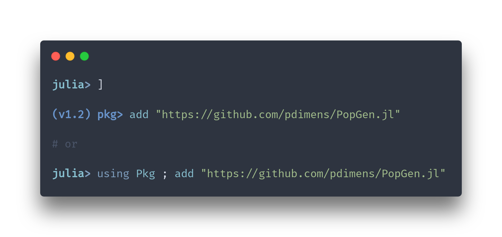

Population Genetics in Julia. This is a fork of `PopGen.jl` in `BioJulia` with the goal of merging with it.

  

## Notice!
This package is in what you might call "aggresive early development". We break things **all the time** in the other branches and occassionally merge those changes with `Master`. Right now, we're in the process of completely changing the data structure from wide-DataFrames to long-IndexedTables, and that's a large piece of work to implement that (and fix every function thereafter to work with the new format). Please bear with us during these changes!  

#### How to install:
Invoke the package manager by pressing `]` on an empty line and `add` this repo

---------

### Authors

  Pavel Dimens, PhD Student @ U. Southern Mississippi

  Jason Selwyn, PhD Candidate @ Texas A&M University - Corpus Christi
