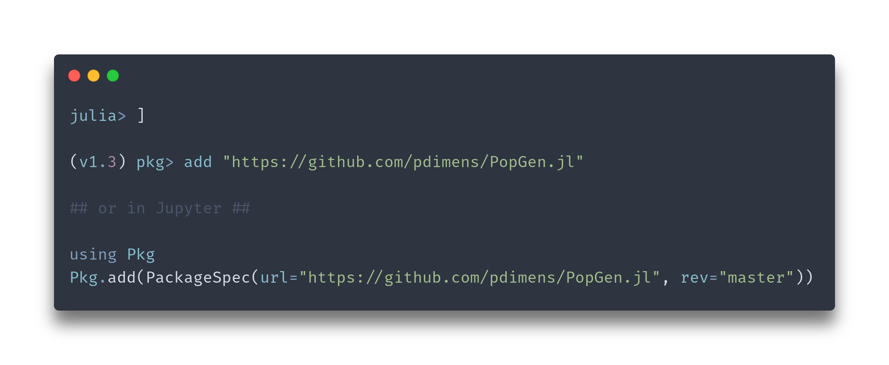

Population Genetics in Julia.This is a fork of `PopGen.jl` in `BioJulia` with the goal of merging with it. 

 

### Want to test out what's available so far?
#### Install instructions:

After the package is installed, load it with `using PopGen`

Feel free to play around with the test data `nancycats` and `gulfsharks`!

---------

### Authors

  Pavel Dimens, PhD Student @ U. Southern Mississippi

  Jason Selwyn, PhD Candidate @ Texas A&M University - Corpus Christi 