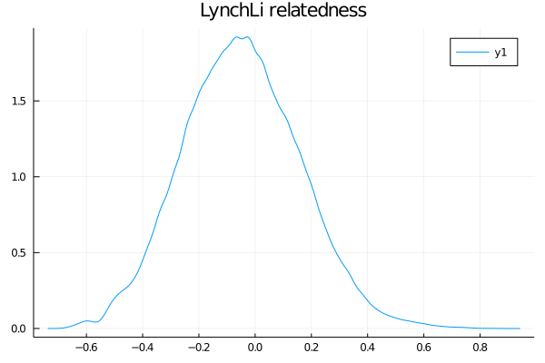

import Tabs from '@theme/Tabs';
import TabItem from '@theme/TabItem';

## Getting Started
In a population genetics study, you often need to identify if there are kin in your data. This may be necessary because you are trying to remove kin from your data (because of Hardy-Weinberg assumptions), or maybe kinship is a central interest in your study. Either way, the goal of this tutorial is to provide you with a basic tutorial on using PopGen.jl to perform a relatedness analysis, which is sometimes called a _kinship_ analysis. To follow along, you'll need to have Julia, along with the packages PopGen.jl, PopGenSims.jl, and StatsBase.jl installed. We'll be using the `nancycats` data because it's smaller than `gulfsharks`, so things should be a lot quicker.

```julia
using PopGen, PopGenSims, StatsBase

julia> cats = @nancycats
PopData Object
  Markers: Microsatellite
  Ploidy: 2
  Samples: 237
  Loci: 9
  Populations: 17
  Coordinates: absent
```

### Estimators
Like `Coancestry` and the R packages that wrap it (i.e. `relate`, `related`), PopGen.jl provides a whole bunch of relatedness estimators that you can choose from for your data. Unfortunately, there is no right answer and you will need to use your discretion. Some people choose an estimator based on the heterozygosity of the data, others choose one based on more liberal or conservative values, and there are yet more criteria one can consider for choosing an estimator. To keep things simple, we're going to use `LynchLi`. Why? Because I'm the one writing this tutorial, and I said so :grin:. 


## The Steps
### 1. Calculate pairwise relatedness
This seems pretty obvious, but it needs to be said. In order to do the analysis, you need you get the pairwise relatedness values for the individuals of interest in your data. To keep things simple, we're going to do an all-by-all comparison. But, we also want to boostrap the pairs to create confidence intervals ("CI") for each pair, so let's talk about that.

### 2. Bootstrap to calculate CI
It would behoove us to bootstrap the loci in a pairwise comparison _n_ number of times so we can create a confidence interval for the relatedness estimates for each pair. This inflates the runtime of the analysis substantially, but it's a very useful method in making sense of our estimates. If one was to be conservative (and we generally are), then we would reject an estimate for a pair whose CI includes zero. In PopGen.jl, the estimates and bootstrapping are done all at once to minimize processing time, so the command for that would be
```julia
julia> rel_out  = relatedness(cats, method = LynchLi, iterations = 1000)
```
By default, the `relatedness` function uses a 95% CI (`interval = (0.025, 0.975)`), but you can change that with `interval = (low,high)` where `low` and `high` are decimals of your quantiles. 
The `relatedness()` function returns a `NamedTuple` of dataframes whenever you are bootstrapping, where each element shares its name with the method used, so in this case, we can access our results with `rel_out.LynchLi`.

<Tabs
  block={true}
  defaultValue="rel"
  values={[
    { label: 'relatedness', value: 'rel', },
    { label: 'plotting', value: 'pl', },
  ]
}>
<TabItem value="rel">

```
julia> rel_out.LynchLi
27966×8 DataFrame
   Row │ sample_1  sample_2  n_loci  LynchLi     LynchLi_mean  LynchLi_median  LynchLi_S ⋯
       │ String    String    Int64   Float64?    Float64?      Float64?        Float64?  ⋯
───────┼──────────────────────────────────────────────────────────────────────────────────
     1 │ N215      N216           8   0.743535      0.747288        0.748042     0.75344 ⋯
     2 │ N215      N217           8   0.230605      0.233593        0.240085     0.34187
     3 │ N215      N218           8   0.230605      0.230507        0.221861     0.32161
     4 │ N215      N219           8   0.230605      0.23601         0.23567      0.32782
     5 │ N215      N220           8   0.333191      0.33798         0.350492     0.39898 ⋯
     6 │ N215      N221           8   0.589656      0.594223        0.601308     0.61945
     7 │ N215      N222           8   0.0254328     0.0347216       0.0262021    0.21408
     8 │ N215      N223           8   0.333191      0.329983        0.331411     0.38402
     9 │ N215      N224           8  -0.0258602    -0.021062       -0.0301579    0.21112 ⋯
    10 │ N215      N7             8  -0.282325     -0.27967        -0.288337     0.33611
    11 │ N215      N141           8  -0.0771532    -0.0796867      -0.083113     0.21261
    12 │ N215      N142           8   0.0254328     0.0302549       0.0330718    0.23957
   ⋮   │    ⋮         ⋮        ⋮         ⋮            ⋮              ⋮             ⋮     ⋱
 27955 │ N295      N289           7   0.322731      0.347021        0.34118      0.41168 ⋯
 27956 │ N295      N290           7   0.153414      0.160102        0.164866     0.22862
 27957 │ N296      N297           7  -0.0159038    -0.0182747      -0.0187108    0.16981
 27958 │ N296      N281           7   0.0405353     0.037025        0.0422647    0.15294
 27959 │ N296      N289           7   0.322731      0.328379        0.337317     0.35578 ⋯
 27960 │ N296      N290           7   0.153414      0.152384        0.16194      0.19131
 27961 │ N297      N281           7  -0.0159038    -0.0128349      -0.0303449    0.21030
 27962 │ N297      N289           7   0.37917       0.392517        0.392818     0.45139
 27963 │ N297      N290           7   0.435609      0.437829        0.450044     0.47027 ⋯
 27964 │ N281      N289           8   0.20428       0.21279         0.207425     0.29611
 27965 │ N281      N290           7   0.37917       0.386583        0.390585     0.45471
 27966 │ N289      N290           7   0.209853      0.217811        0.222894     0.28649
                                                          2 columns and 27942 rows omitted
```

</TabItem>
<TabItem value="pl">

And while it's totally optional, we can plot the distribution of values for some visual data exploration. For that we'll use Plots.jl and StatsPlots.jl. 

:::note plotting packages
We could have used any plotting package, but Plots.jl was chosen for simplicity. Other great
options are (and not limited to): Makie.jl, Gadfly.jl, VegaLite.jl, and PlotlyJS.jl.
:::

```julia
using Plots, StatsPlots

julia> density(rel_out.LynchLi.LynchLi)
julia> title!("LynchLi relatedness")
```



</TabItem>
</Tabs>

### 3. Create CI's for the sibships

:::note There's more???
The next set of steps seem like a lot more work, so allow me to explain. The estimators all generally give you some value between 0-1 (or 0-0.5, same idea) and you can intuit that certain values mean certain things, like that `0` is "unrelated", `0.25` is "half-sib", and `0.5` is "full-sib". However, those are fixed values, so how do we know how far we can deviate from 0.25 (for example) and still call our pair half-siblings? Instead of hand-waving, we can create confidence intervals from simulated data to act as sibship ranges for our data. If this doesn't make sense yet, it will below. Promise! 
:::

#### i. simulate known sibship pairs
Next, we need to further contextualize what out estimates actually mean, and we need to devise a rigorous and defensible method to define the sibling-ship ("sibship") of a pair of samples as **unrelated**, **half-sibs**, or **full-sibs**. To do this, we're going to use PopGenSims.jl to simulate data based on the allele frequencies in our data. What `simulate_sibship` does is simulate individuals based on the allele frequencies in your `PopData`, then simulate offspring of a particular siblingship resulting from the "mating" of those individuals. For example, when you specify `"fullsib"`, it generates two offspring resulting from two parents, `n` number of times. We want to do this for each of the three kinds of sibships.

<Tabs
  block={true}
  defaultValue="un"
  values={[
    { label: 'simulate unrelated', value: 'un', },
    { label: 'simulate halfsib', value: 'h', },
    { label: 'simulate fullsib', value: 'f', },
  ]
}>
<TabItem value="un">

```julia
julia> unrelated_sims = simulate_sibship(cats, n = 500, relationship= "unrelated")
PopData Object
  Markers: Microsatellite
  Ploidy: 2
  Samples: 1000
  Loci: 9
  Populations: 1
  Coordinates: absent
```

</TabItem>
<TabItem value="h">

```julia
julia> halfsib_sims = simulate_sibship(cats, n = 500, relationship= "halfsib")
PopData Object
  Markers: Microsatellite
  Ploidy: 2
  Samples: 1000
  Loci: 9
  Populations: 1
  Coordinates: absent
```

</TabItem>
<TabItem value="f">

```julia
julia> fullsib_sims = simulate_sibship(cats, n = 500, relationship= "fullsib")
PopData Object
  Markers: Microsatellite
  Ploidy: 2
  Samples: 1000
  Loci: 9
  Populations: 1
  Coordinates: absent
```

</TabItem>
</Tabs>

Technically, we could merge all three results into a single `PopData`, but it will be easier to explain things if we don't. Feel free to take a peep into the simulated data:

<Tabs
  block={true}
  defaultValue=""
  values={[
    { label: 'meta', value: 'meta', },
    { label: 'loci', value: 'loci', },
  ]
}>
<TabItem value="meta">

```
julia> unrelated_sims.meta
1000×5 DataFrame
  Row │ name            population  ploidy  longitude  latitude 
      │ String          String      Int64   Float32?   Float32? 
──────┼─────────────────────────────────────────────────────────
    1 │ sim1_un_off1    unrelated        2   missing   missing  
    2 │ sim1_un_off2    unrelated        2   missing   missing  
    3 │ sim2_un_off1    unrelated        2   missing   missing  
    4 │ sim2_un_off2    unrelated        2   missing   missing  
    5 │ sim3_un_off1    unrelated        2   missing   missing  
    6 │ sim3_un_off2    unrelated        2   missing   missing  
    7 │ sim4_un_off1    unrelated        2   missing   missing  
    8 │ sim4_un_off2    unrelated        2   missing   missing  
    9 │ sim5_un_off1    unrelated        2   missing   missing  
   10 │ sim5_un_off2    unrelated        2   missing   missing  
   11 │ sim6_un_off1    unrelated        2   missing   missing  
   12 │ sim6_un_off2    unrelated        2   missing   missing  
  ⋮   │       ⋮             ⋮         ⋮         ⋮         ⋮
  989 │ sim495_un_off1  unrelated        2   missing   missing  
  990 │ sim495_un_off2  unrelated        2   missing   missing  
  991 │ sim496_un_off1  unrelated        2   missing   missing  
  992 │ sim496_un_off2  unrelated        2   missing   missing  
  993 │ sim497_un_off1  unrelated        2   missing   missing  
  994 │ sim497_un_off2  unrelated        2   missing   missing  
  995 │ sim498_un_off1  unrelated        2   missing   missing  
  996 │ sim498_un_off2  unrelated        2   missing   missing  
  997 │ sim499_un_off1  unrelated        2   missing   missing  
  998 │ sim499_un_off2  unrelated        2   missing   missing  
  999 │ sim500_un_off1  unrelated        2   missing   missing  
 1000 │ sim500_un_off2  unrelated        2   missing   missing  
                                                976 rows omitted

```

</TabItem>
<TabItem value="loci">

```
julia> unrelated_sims.loci
9000×4 DataFrame
  Row │ name            population  locus   genotype   
      │ String          String      String  Tuple…     
──────┼────────────────────────────────────────────────
    1 │ sim1_un_off1    unrelated   fca8    (135, 141)
    2 │ sim1_un_off1    unrelated   fca23   (132, 132)
    3 │ sim1_un_off1    unrelated   fca43   (143, 139)
    4 │ sim1_un_off1    unrelated   fca45   (126, 116)
    5 │ sim1_un_off1    unrelated   fca77   (154, 148)
    6 │ sim1_un_off1    unrelated   fca78   (150, 142)
    7 │ sim1_un_off1    unrelated   fca90   (199, 193)
    8 │ sim1_un_off1    unrelated   fca96   (109, 91)
    9 │ sim1_un_off1    unrelated   fca37   (208, 210)
   10 │ sim1_un_off2    unrelated   fca8    (139, 123)
   11 │ sim1_un_off2    unrelated   fca23   (140, 130)
   12 │ sim1_un_off2    unrelated   fca43   (139, 141)
  ⋮   │       ⋮             ⋮         ⋮         ⋮
 8989 │ sim500_un_off1  unrelated   fca90   (199, 197)
 8990 │ sim500_un_off1  unrelated   fca96   (105, 113)
 8991 │ sim500_un_off1  unrelated   fca37   (208, 208)
 8992 │ sim500_un_off2  unrelated   fca8    (135, 137)
 8993 │ sim500_un_off2  unrelated   fca23   (136, 130)
 8994 │ sim500_un_off2  unrelated   fca43   (139, 145)
 8995 │ sim500_un_off2  unrelated   fca45   (120, 120)
 8996 │ sim500_un_off2  unrelated   fca77   (150, 156)
 8997 │ sim500_un_off2  unrelated   fca78   (142, 152)
 8998 │ sim500_un_off2  unrelated   fca90   (189, 191)
 8999 │ sim500_un_off2  unrelated   fca96   (113, 113)
 9000 │ sim500_un_off2  unrelated   fca37   (208, 182)
                                      8976 rows omitted
```

</TabItem>
</Tabs>

#### ii. get relatedness estimates for the simulated data
Next, we want to get the relatedness estimate for each simulated pair of "known" sibship. We are only interested in the values for the simulated pairs and not samples across pairs. If you aren't sure why that is, think of it this way: we're trying to create a range of values where we can confidently say unknown things are full-sibs (or half-sib, etc.), so we want to know what range of values we get from a bunch of known fullsib pairs, not the unknown relationships of samples between pairs. 

It would a nightmare to manually specify only 2 individuals at a time into `relatedness()`. Instead, the function has a shortcut built into it that will recognize the `population` names generated from `simulate_sibship` and only give you relatedness estimates for those pairs. So, we just need to run it once for each of our simulations, this time _without_ bootstrapping because we are only interested in the estimates. Make sure to use the same estimator! The run will be a lot faster this time because it only needs to calculate estimates for 500 pairs each time (our `n` from above) and without bootstrapping. When not bootstrapping, `relatedness()` returns a dataframe (versus a NamedTuple of dataframes).

<Tabs
  block={true}
  defaultValue="un"
  values={[
    { label: 'unrelated relatedness', value: 'un', },
    { label: 'halfsib relatedness', value: 'h', },
    { label: 'fullsib relatedness', value: 'f', },
  ]
}>
<TabItem value="un">

```julia
julia> un_sims_rel = relatedness(unrelated_sims, method = LynchLi)
500×4 DataFrame
 Row │ sample_1        sample_2        n_loci  LynchLi    
     │ String          String          Int64   Float64?   
─────┼────────────────────────────────────────────────────
   1 │ sim100_un_off1  sim100_un_off2       9   0.0187624
   2 │ sim101_un_off1  sim101_un_off2       9  -0.204246
   3 │ sim102_un_off1  sim102_un_off2       9   0.0633641
   4 │ sim103_un_off1  sim103_un_off2       9   0.241771
   5 │ sim104_un_off1  sim104_un_off2       9  -0.338051
   6 │ sim105_un_off1  sim105_un_off2       9   0.0187624
   7 │ sim106_un_off1  sim106_un_off2       9  -0.29345
   8 │ sim107_un_off1  sim107_un_off2       9   0.0633641
  ⋮  │       ⋮               ⋮           ⋮         ⋮
 494 │ sim94_un_off1   sim94_un_off2        9  -0.159644
 495 │ sim95_un_off1   sim95_un_off2        9  -0.0704411
 496 │ sim96_un_off1   sim96_un_off2        9   0.0633641
 497 │ sim97_un_off1   sim97_un_off2        9   0.241771
 498 │ sim98_un_off1   sim98_un_off2        9  -0.0704411
 499 │ sim99_un_off1   sim99_un_off2        9   0.241771
 500 │ sim9_un_off1    sim9_un_off2         9   0.197169
                                          485 rows omitted
```

</TabItem>
<TabItem value="h">

```julia
julia> half_sims_rel = relatedness(halfsib_sims, method = LynchLi)
500×4 DataFrame
 Row │ sample_1        sample_2        n_loci  LynchLi    
     │ String          String          Int64   Float64?   
─────┼────────────────────────────────────────────────────
   1 │ sim100_hs_off1  sim100_hs_off2       9   0.111231
   2 │ sim101_hs_off1  sim101_hs_off2       9   0.111231
   3 │ sim102_hs_off1  sim102_hs_off2       9   0.333423
   4 │ sim103_hs_off1  sim103_hs_off2       9  -0.0220842
   5 │ sim104_hs_off1  sim104_hs_off2       9   0.111231
   6 │ sim105_hs_off1  sim105_hs_off2       9   0.244546
   7 │ sim106_hs_off1  sim106_hs_off2       9   0.244546
   8 │ sim107_hs_off1  sim107_hs_off2       9   0.377862
  ⋮  │       ⋮               ⋮           ⋮         ⋮
 494 │ sim94_hs_off1   sim94_hs_off2        9   0.200108
 495 │ sim95_hs_off1   sim95_hs_off2        9   0.244546
 496 │ sim96_hs_off1   sim96_hs_off2        9   0.0223543
 497 │ sim97_hs_off1   sim97_hs_off2        9   0.200108
 498 │ sim98_hs_off1   sim98_hs_off2        9   0.111231
 499 │ sim99_hs_off1   sim99_hs_off2        9   0.333423
 500 │ sim9_hs_off1    sim9_hs_off2         9   0.288985
                                          485 rows omitted
```

</TabItem>
<TabItem value="f">

```julia
julia> full_sims_rel = relatedness(fullsib_sims, method = LynchLi)
500×4 DataFrame
 Row │ sample_1        sample_2        n_loci  LynchLi   
     │ String          String          Int64   Float64?  
─────┼───────────────────────────────────────────────────
   1 │ sim100_fs_off1  sim100_fs_off2       9  0.510483
   2 │ sim101_fs_off1  sim101_fs_off2       9  0.465982
   3 │ sim102_fs_off1  sim102_fs_off2       9  0.42148
   4 │ sim103_fs_off1  sim103_fs_off2       9  0.376979
   5 │ sim104_fs_off1  sim104_fs_off2       9  0.465982
   6 │ sim105_fs_off1  sim105_fs_off2       9  0.688489
   7 │ sim106_fs_off1  sim106_fs_off2       9  0.287976
   8 │ sim107_fs_off1  sim107_fs_off2       9  0.599486
  ⋮  │       ⋮               ⋮           ⋮         ⋮
 494 │ sim94_fs_off1   sim94_fs_off2        9  0.688489
 495 │ sim95_fs_off1   sim95_fs_off2        9  0.821994
 496 │ sim96_fs_off1   sim96_fs_off2        9  0.554985
 497 │ sim97_fs_off1   sim97_fs_off2        9  0.599486
 498 │ sim98_fs_off1   sim98_fs_off2        9  0.554985
 499 │ sim99_fs_off1   sim99_fs_off2        9  0.510483
 500 │ sim9_fs_off1    sim9_fs_off2         9  0.376979
                                         485 rows omitted
```

</TabItem>
</Tabs>

And if we wanted to plot out what that looks like (optional):
```julia
using Plots, StatsPlots

julia> density(rel_out.LynchLi.LynchLi, label = "real data", color = :grey, fill = (0, :grey))
julia> density!(un_sims_rel.LynchLi, label = "unrelated")
julia> density!(half_sims_rel.LynchLi, label = "halfsib", color = :blue)
julia> density!(full_sims_rel.LynchLi, label = "fullsib", color = :black)
julia> title!("relatedness estimates on simulated and real data")
```


Hopefully by now you are starting to contextualize why we're doing all of this. The distributions generated from our simulated data are giving us a better indication of what "unrelated", "halfsib", and "fullsib" estimates look like in our data.

#### iii. sibship intervals
What we just did is create null distributions for each sibship relationship, so now all that's left is to get a confidence interval from each.

```julia
julia> unrelated_ci = quantile(un_sims_rel.LynchLi, (0.025, 0.975))
(-0.3380513384854698, 0.33097433075726507)

julia> halfsibs_ci = quantile(half_sims_rel.LynchLi, (0.025, 0.975))
(-0.06652262584414452, 0.5556155725649398)

julia> fullsibs_ci = quantile(full_sims_rel.LynchLi, (0.025, 0.975))
(0.1989727186688347, 0.8219939374819633)
```

So, given our data and the simulations we made, we can now make a reasonable assumption regarding the ranges for each sibship relationship:

| Relationship | Lower Bound | Upper Bound |
| :------ | :---: | :---: |
| unrelated | -0.338 | 0.331 |
| half sibling | -0.066 | 0.555 |
| full sibling | 0.199 | 0.82 |

### 4. Finally, the data assessment
Now that we have our relatedness estimates and the acceptable sibship ranges given our data, we can see where our data falls.
_Now_, we can say that a particular sample pair is unrelated/halfsib/fullsib if:
1. that pair's confidence interval does not include zero and 
2. that pair's estimate falls within any of the three calculate ranges

Unfortunately, the ranges overlap quite a bit, which makes interpretation difficult, so it may be suitable to use a different estimator. 

### Closing remarks
There is more that can be done for relatedness, like network analysis. However, this tutorial covers what we consider a reasonable way to assess kinship in population genetic studies. If removing kin is your ultimate goal, consider the effects doing that may have on the analyses you are looking to do. Additionally, consider which individual of a pair you would remove and why. If you were curious as to how many identical loci a pair of samples may share, you can check that using `pairwise_identical()`. Good luck!
