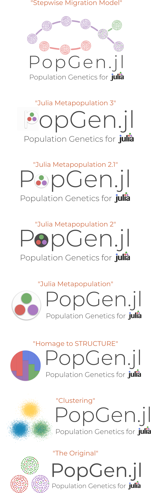

Hi, Pavel here. Despite all the fancy stuff in the package and in these docs, I wanna talk about our logo real quick.

## What exactly that logo?

If you haven't guessed already, it's the beloved Punnett Square! Nothing screams genetics like everyone's first entry-level genetic diagram. And guess what this package doesn't do... Punnett Squares! The irony is deliberate, _we swear_. :upside_down_face: 


## The Logo Graveyard

While this is completely unrelated to anything important about population genetics or Julia, I want you all to understand the logo-development process that led us to our logo so you can _feel_ my struggle. The process is as follows:

1. Jason and Pavel spitball ideas

2. Pavel procrastinates real work and opens up Inkscape to draft some ideas

3. Pavel composes 1-3 versions of an idea and sends it to Jason

4. 
   ```
   if Jason != veto
   	for i in 1:5
		Jason critiques and suggests changes
   		Pavel makes the changes
   	end
   end	
   ```
   
5. Pavel and Jason finalize the idea!

6. Weeks pass and Pavel isn't quite satisfied and we start at 1 again


I'm happy to say that we love the Punnett Square and it's for keeps, but have a look at the scrapped ideas as a little walk down memory lane:




