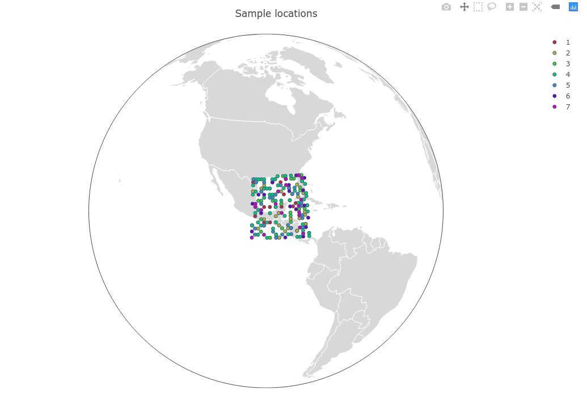

These are the included PopObj viewing and manipulating commands. Using standard Julia conventions, only commands ending with a bang `!` are mutable, meaning they alter the input data. So, commands like `popid` will show you population ID's, whereas `popid!` will change them in your `PopObj`. The mutable commands here alter the data in your `PopObj`, but not the source data (i.e. the files used to create the `PopObj`).


To follow along like a tutorial,  use the `gulfsharks` data. Load the data in if you haven't already:

```julia
julia> using PopGen

julia> sharks = gulfsharks() ;
```


## Individuals / Samples

### view individuals' names

```julia
samples(x::PopObj)
```
View individual/sample names in a `PopObj`. This is equivalent to `PopObj.samples.name`

``` julia tab="indnames"
samples(sharks)
```

``` tab="output"
212-element Array{String,1}:
 "cc_001" 
 "cc_002" 
 "cc_003" 
 "cc_005" 
 "cc_007" 
 "cc_008" 
 "cc_009" 
 "cc_010" 
 "cc_012" 
 "cc_013" 
 ⋮        
 "seg_023"
 "seg_024"
 "seg_025"
 "seg_026"
 "seg_027"
 "seg_028"
 "seg_029"
 "seg_030"
 "seg_031"
```

### remove individuals

```julia
remove_samples!(x::PopObj, samp_id::Union{String, Array{String,1}})
```

Removes selected individuals from a `PopObj`. Input can be a single sample, or an array of samples. Will output entire `PopObj`, so it's better to use a semicolon to suppress the output. Use `summary` or `.name`  if you want to confirm that the samples were removed. This command will inform you if samples were not found in the data.

Examples:

``` julia tab="single individual"
julia> remove_samples!(sharks, "cc_001") ;

julia> summary(sharks)
```

``` tab="single output"
Object of type PopObj:

Longitude:
["-80.59958", "-80.42248", "-80.35779"] … ["-87.36617", "-85.71432", "-85.71432"]

Latitude:
["28.30624", "28.30787", "28.30234"] … ["30.05217", "29.82344", "29.82344"]


Number of individuals: 211
["cc_002", "cc_003", "cc_005"] … ["seg_029", "seg_030", "seg_031"]

Number of loci: 2213
["contig_35208", "contig_23109", "contig_4493"] … ["contig_19384", "contig_22368", "contig_2784"]

Ploidy: 2
Number of populations: 7

   #Inds | Pop
   --------------
	 20	 |	1
	 30	 |	2
	 28	 |	3
	 65	 |	4
	 28	 |	5
	 20	 |	6
	 20	 |	7

Available .samples fields: .name, .population, .ploidy, .longitude, .latitude
```

``` julia tab="multiple individuals"
julia> remove_samples!(sharks, ["cc_001","cc_002", "cc_003"]) ; 

julia> summary(sharks)
```

``` tab="multiple output"
NOTICE: ind "cc_001" not found!

Object of type PopObj:

Longitude:
["-80.34815", "-80.34822", "-80.43027"] … ["-87.36617", "-85.71432", "-85.71432"]

Latitude:
["28.30624", "28.30787", "28.30234"] … ["30.05217", "29.82344", "29.82344"]


Number of individuals: 209
["cc_005", "cc_007", "cc_008"] … ["seg_029", "seg_030", "seg_031"]

Number of loci: 2213
["contig_35208", "contig_23109", "contig_4493"] … ["contig_19384", "contig_22368", "contig_2784"]

Ploidy: 2
Number of populations: 7

   #Inds | Pop
   --------------
	 18	 |	1
	 30	 |	2
	 28	 |	3
	 65	 |	4
	 28	 |	5
	 20	 |	6
	 20	 |	7

Available .samples fields: .name, .population, .ploidy, .longitude, .latitude
```

!!! info "sample not found!"
    If removing a single sample and it is not found in the PopObj, an error will be returned. However, if removing multiple samples, you will receive a notice above the PopObj summary indicating which individuals were not found, while removing the ones that were.

## Population ID's
### view population names
```julia
populations(x::PopObj; listall::Bool = false)
```
Just as you can view population ID's with `.population`, you can also view them with the `populations` command, which by default shows you a summary of the number of individuals in each population, much like you see when using `summary`.  

``` julia tab="popid"
julia> populations(sharks)
```

``` tab="output"
│ Row │ population    │ count │
│     │ String        │ Int32 │
├─────┼───────────────┼───────┤
│ 1   │ 1             │ 21    │
│ 2   │ 2             │ 30    │
│ 3   │ 3             │ 28    │
│ 4   │ 4             │ 65    │
│ 5   │ 5             │ 28    │
│ 6   │ 6             │ 20    │
│ 7   │ 7             │ 20    │
```

You can use the keyword `listall=true` to display each individual and their associated population as a DataFrame. You'll notice the DataFrame looks remarkably like the first two columns of the one from `locations`, and it sort of is. Unlike `locations`, this will not give you an error when location data is missing. 

``` julia tab="listall=true"
julia> populations(sharks, listall=true)
```

``` tab="output"
212×2 DataFrames.DataFrame
│ Row │ ind     │ population │
│     │ String  │ Union…     │
├─────┼─────────┼────────────┤
│ 1   │ cc_001  │ 1          │
│ 2   │ cc_002  │ 1          │
│ 3   │ cc_003  │ 1          │
│ 4   │ cc_005  │ 1          │
│ 5   │ cc_007  │ 1          │
│ 6   │ cc_008  │ 1          │
│ 7   │ cc_009  │ 1          │
⋮
│ 205 │ seg_024 │ 7          │
│ 206 │ seg_025 │ 7          │
│ 207 │ seg_026 │ 7          │
│ 208 │ seg_027 │ 7          │
│ 209 │ seg_028 │ 7          │
│ 210 │ seg_029 │ 7          │
│ 211 │ seg_030 │ 7          │
│ 212 │ seg_031 │ 7          │
```

!!! note "synonymous functions"
    You can use the command `population` for the same functionality. We made the commands `population` and `populations` synonymous so you wouldn't have to memorize if the name was singular or plural-- it just works! This also applies to `populations!` and `population!`

### rename populations

```julia
popid!(x::PopObj; rename::Dict)
```
Rename the population ID's of a `PopObj` (the `.popid`). Uses a `Dict` of `[popid] => replacement` to rename. It returns `popid(::PopObj,listall=true)` of your renamed PopObj.

``` julia tab="rename populations"
# create a dictionary of name conversions
julia> new_popnames = Dict(1 => "Cape Canaveral",
						   2 => "Georgia",
						   3 => "S Carolina",
    					   4 => "FL Keys",
    					   5 => "Mideast Gulf",
    					   6 => "Northeast Gulf",
    					   7 => "Southeast Gulf")

julia> popid!(sharks, rename = new_popnames)
```

``` tab="output"
212×2 DataFrame
│ Row │ ind     │ population     │
│     │ String  │ Union…         │
├─────┼─────────┼────────────────┤
│ 1   │ cc_001  │ Cape Canaveral │
│ 2   │ cc_002  │ Cape Canaveral │
│ 3   │ cc_003  │ Cape Canaveral │
│ 4   │ cc_005  │ Cape Canaveral │
│ 5   │ cc_007  │ Cape Canaveral │
│ 6   │ cc_008  │ Cape Canaveral │
│ 7   │ cc_009  │ Cape Canaveral │
│ 8   │ cc_010  │ Cape Canaveral │
│ 9   │ cc_012  │ Cape Canaveral │
│ 10  │ cc_013  │ Cape Canaveral │
│ 11  │ cc_014  │ Cape Canaveral │
│ 12  │ cc_015  │ Cape Canaveral │
│ 13  │ cc_016  │ Cape Canaveral │
│ 14  │ cc_017  │ Cape Canaveral │
│ 15  │ cc_018  │ Cape Canaveral │
│ 16  │ cc_019  │ Cape Canaveral │
│ 17  │ cc_020  │ Cape Canaveral │
│ 18  │ cc_021  │ Cape Canaveral │
⋮
│ 194 │ seg_003 │ Southeast Gulf │
│ 195 │ seg_009 │ Southeast Gulf │
│ 196 │ seg_010 │ Southeast Gulf │
│ 197 │ seg_011 │ Southeast Gulf │
│ 198 │ seg_012 │ Southeast Gulf │
│ 199 │ seg_014 │ Southeast Gulf │
│ 200 │ seg_015 │ Southeast Gulf │
│ 201 │ seg_016 │ Southeast Gulf │
│ 202 │ seg_018 │ Southeast Gulf │
│ 203 │ seg_021 │ Southeast Gulf │
│ 204 │ seg_023 │ Southeast Gulf │
│ 205 │ seg_024 │ Southeast Gulf │
│ 206 │ seg_025 │ Southeast Gulf │
│ 207 │ seg_026 │ Southeast Gulf │
│ 208 │ seg_027 │ Southeast Gulf │
│ 209 │ seg_028 │ Southeast Gulf │
│ 210 │ seg_029 │ Southeast Gulf │
│ 211 │ seg_030 │ Southeast Gulf │
│ 212 │ seg_031 │ Southeast Gulf │
```

## Display Specific Loci and/or Samples
### get loci names

```
loci(x::PopObj)
```

Returns an array of strings of the loci names in a `PopObj`

```julia tab="example"
julia> loci(sharks)
```

``` tab="output"
2213-element Array{String,1}:
 "contig_35208"
 "contig_23109"
 "contig_4493" 
 "contig_10742"
 "contig_14898"
 "contig_8483" 
 "contig_8065" 
 "contig_14708"
 "contig_2307" 
 ⋮             
 "contig_24711"
 "contig_18959"
 "contig_43517"
 "contig_27356"
 "contig_475"  
 "contig_19384"
 "contig_22368"
 "contig_2784" 
```


### view loci

```julia
view_genotypes(x::PopObj; samples= nothing, loci= nothing)
```

Default shows all genotypes for all individuals. Returns a DataFrame.

``` julia tab="all loci"
julia> view_genotypes(sharks)
```

``` tab="output"
212×2215 DataFrames.DataFrame. Omitted printing of 2209 columns
│ Row │ ind     │ population   │ contig_10001 │ contig_10013 │ contig_10028 │ contig_10035 │
│     │ String  │ String       │ Any          │ Any          │ Any          │ Any          │
├─────┼─────────┼──────────────┼──────────────┼──────────────┼──────────────┼──────────────┤
│ 1   │ cc_001  │ 1            │ (1, 1)       │ (1, 1)       │ (1, 1)       │ (1, 1)       │
│ 2   │ cc_002  │ 1            │ (1, 1)       │ (1, 1)       │ (1, 1)       │ (1, 1)       │
│ 3   │ cc_003  │ 1            │ (1, 1)       │ (1, 1)       │ (2, 1)       │ (1, 1)       │
│ 4   │ cc_005  │ 1            │ (1, 1)       │ (1, 1)       │ (1, 1)       │ (2, 1)       │
│ 5   │ cc_007  │ 1            │ (1, 1)       │ (1, 1)       │ (2, 1)       │ (2, 1)       │
│ 6   │ cc_008  │ 1            │ (1, 1)       │ (1, 2)       │ (2, 1)       │ (1, 1)       │
│ 7   │ cc_009  │ 1            │ (1, 1)       │ (1, 2)       │ (2, 1)       │ (2, 1)       │
⋮
│ 205 │ seg_024 │ 7            │ (1, 1)       │ (1, 1)       │ (1, 1)       │ (1, 1)       │
│ 206 │ seg_025 │ 7            │ (1, 1)       │ (1, 1)       │ (2, 1)       │ (2, 2)       │
│ 207 │ seg_026 │ 7            │ (1, 1)       │ (1, 1)       │ (2, 1)       │ (2, 2)       │
│ 208 │ seg_027 │ 7            │ (1, 1)       │ (1, 1)       │ (1, 1)       │ (2, 2)       │
│ 209 │ seg_028 │ 7            │ (1, 1)       │ (1, 1)       │ (2, 1)       │ (2, 2)       │
│ 210 │ seg_029 │ 7            │ (1, 1)       │ (1, 1)       │ (2, 1)       │ (2, 2)       │
│ 211 │ seg_030 │ 7            │ (1, 1)       │ (1, 1)       │ (2, 1)       │ (2, 2)       │
│ 212 │ seg_031 │ 7            │ (1, 1)       │ (1, 1)       │ (1, 1)       │ (1, 1)       │
```

Add the argument  `loci=` specify a single locus (string) or multiple loci (array of strings) to display

``` julia tab="single locus"
julia> view_genotypes(sharks, loci = "contig_10001")
```

``` tab="single output"
212×3 DataFrames.DataFrame
│ Row │ ind     │ population   │ contig_10001 │
│     │ String  │ String       │ Any          │
├─────┼─────────┼──────────────┼──────────────┤
│ 1   │ cc_001  │ 1            │ (1, 1)       │
│ 2   │ cc_002  │ 1            │ (1, 1)       │
│ 3   │ cc_003  │ 1            │ (1, 1)       │
│ 4   │ cc_005  │ 1            │ (1, 1)       │
│ 5   │ cc_007  │ 1            │ (1, 1)       │
│ 6   │ cc_008  │ 1            │ (1, 1)       │
│ 7   │ cc_009  │ 1            │ (1, 1)       │
⋮
│ 205 │ seg_024 │ 7            │ (1, 1)       │
│ 206 │ seg_025 │ 7            │ (1, 1)       │
│ 207 │ seg_026 │ 7            │ (1, 1)       │
│ 208 │ seg_027 │ 7            │ (1, 1)       │
│ 209 │ seg_028 │ 7            │ (1, 1)       │
│ 210 │ seg_029 │ 7            │ (1, 1)       │
│ 211 │ seg_030 │ 7            │ (1, 1)       │
│ 212 │ seg_031 │ 7            │ (1, 1)       │
```

``` julia tab="multiple loci"
julia> view_genotypes(sharks, loci = ["contig_10001", "contig_10028"])
```

``` tab="multiple output"
212×4 DataFrames.DataFrame
│ Row │ ind     │ population   │ contig_10001 │ contig_10028 │
│     │ String  │ String       │ Any          │ Any          │
├─────┼─────────┼──────────────┼──────────────┼──────────────┤
│ 1   │ cc_001  │ 1            │ (1, 1)       │ (1, 1)       │
│ 2   │ cc_002  │ 1            │ (1, 1)       │ (1, 1)       │
│ 3   │ cc_003  │ 1            │ (1, 1)       │ (2, 1)       │
│ 4   │ cc_005  │ 1            │ (1, 1)       │ (1, 1)       │
│ 5   │ cc_007  │ 1            │ (1, 1)       │ (2, 1)       │
│ 6   │ cc_008  │ 1            │ (1, 1)       │ (2, 1)       │
│ 7   │ cc_009  │ 1            │ (1, 1)       │ (2, 1)       │
⋮
│ 205 │ seg_024 │ 7            │ (1, 1)       │ (1, 1)       │
│ 206 │ seg_025 │ 7            │ (1, 1)       │ (2, 1)       │
│ 207 │ seg_026 │ 7            │ (1, 1)       │ (2, 1)       │
│ 208 │ seg_027 │ 7            │ (1, 1)       │ (1, 1)       │
│ 209 │ seg_028 │ 7            │ (1, 1)       │ (2, 1)       │
│ 210 │ seg_029 │ 7            │ (1, 1)       │ (2, 1)       │
│ 211 │ seg_030 │ 7            │ (1, 1)       │ (2, 1)       │
│ 212 │ seg_031 │ 7            │ (1, 1)       │ (1, 1)       │
```

### view samples

Add the argument  `samples=` specify a single sample (string) or multiple samples (array of strings) to display

```julia tab="single sample"
julia> view_genotypes(sharks, samples = "cc_001")
```

``` tab="single output"
1×2215 DataFrames.DataFrame. Omitted printing of 2209 columns
│ Row │ name   │ population    │ contig_10001 │ contig_10013 │ contig_10028 │ contig_10035 │
│     │ String │ String        │ Any          │ Any          │ Any          │ Any          │
├─────┼────────┼───────────────┼──────────────┼──────────────┼──────────────┼──────────────┤
│ 1   │ cc_001 │ 1             │ (1, 1)       │ (1, 1)       │ (1, 1)       │ (1, 1)       │
```

```julia tab="multiple samples"
2×2215 DataFrames.DataFrame. Omitted printing of 2209 columns
│ Row │ name    │ population    │ contig_10001 │ contig_10013 │ contig_10028 │ contig_10035 │
│     │ String  │ String        │ Any          │ Any          │ Any          │ Any          │
├─────┼─────────┼───────────────┼──────────────┼──────────────┼──────────────┼──────────────┤
│ 1   │ cc_001  │ 1             │ (1, 1)       │ (1, 1)       │ (1, 1)       │ (1, 1)       │
│ 2   │ seg_028 │ 7             │ (1, 1)       │ (1, 1)       │ (1, 2)       │ (2, 2)       │
```

It also means that you can combine the keywords `samples=` and `loci=` to further specify your output:

```julia tab="both keywords"
view_genotypes(sharks, samples= ["cc_001", "seg_028"], loci = "contig_10013")
```

``` tab="output"
2×3 DataFrames.DataFrame
│ Row │ name    │ population    │ contig_10013 │
│     │ String  │ String        │ Any          │
├─────┼─────────┼───────────────┼──────────────┤
│ 1   │ cc_001  │ 1             │ (1, 1)       │
│ 2   │ seg_028 │ 7             │ (1, 1)       │
```


## Remove Loci

```julia
remove_loci!(x::PopObj, loci::Union{String, Array{String,1}})
```

Removes selected loci from a `PopObj`. Input can be a single locus, or an array of loci.

Examples:

``` julia tab="single locus"
julia> remove_loci!(sharks, "contig_35208") ;

julia> summary(sharks)

```

``` tab="single output"
Object of type PopObj:

Longitude:
["-80.59928", "-80.59954", "-80.59958"] … ["-87.36617", "-85.71432", "-85.71432"]

Latitude:
["28.30624", "28.30787", "28.30234"] … ["30.05217", "29.82344", "29.82344"]


Number of individuals: 212
["cc_001", "cc_002", "cc_003"] … ["seg_029", "seg_030", "seg_031"]

Number of loci: 2212
["contig_23109", "contig_4493", "contig_10742"] … ["contig_19384", "contig_22368", "contig_2784"]

Ploidy: 2
Number of populations: 7

   #Inds | Pop
   --------------
     21  |  1
     30  |  2
     28  |  3
     65  |  4
     28  |  5
     20  |  6
     20  |  7

Available .samples fields: .name, .population, .ploidy, .longitude, .latitude
```

``` julia tab="multiple loci"
julia> remove_loci!(sharks, ["contig_35208", "contig_23109", "contig_4493"]) ;

julia> summary(sharks)
```

``` tab="multiple output"
NOTICE: locus "contig_35208" not found

Object of type PopObj:

Longitude:
["-80.59928", "-80.59954", "-80.59958"] … ["-87.36617", "-85.71432", "-85.71432"]

Latitude:
["28.30624", "28.30787", "28.30234"] … ["30.05217", "29.82344", "29.82344"]


Number of individuals: 212
["cc_001", "cc_002", "cc_003"] … ["seg_029", "seg_030", "seg_031"]

Number of loci: 2210
["contig_10742", "contig_14898", "contig_8483"] … ["contig_19384", "contig_22368", "contig_2784"]

Ploidy: 2
Number of populations: 7

   #Inds | Pop
   --------------
     21  |  1
     30  |  2
     28  |  3
     65  |  4
     28  |  5
     20  |  6
     20  |  7

Available .samples fields: .name, .population, .ploidy, .longitude, 
```

!!! info "locus not found!"
    If removing a single locus and it is not found in the PopObj, an error will be returned. However, if removing multiple loci, you will receive a notice above the PopObj summary indicating which loci were not found, while removing the ones that were.

## Missing Data
### view missing data

```julia
missing(x::PopObj)
```

Used to show missingness information-- that is, loci missing allele information. This command outputs two DataFrames, the first being a count of number of missing loci per samples, the other being the number of times a locus is missing across samples. 

``` julia tab="missing"
julia> missing(sharks)
```

``` tab="output"
by_ind = (212×4 DataFrames.DataFrame. Omitted printing of 1 columns
│ Row │ name    │ population │ missing │
│     │ String  │ String     │ Any      │
├─────┼─────────┼────────────┼──────────┤
│ 1   │ cc_001  │ 1          │ 124      │
│ 2   │ cc_002  │ 1          │ 94       │
│ 3   │ cc_003  │ 1          │ 100      │
│ 4   │ cc_005  │ 1          │ 0        │
│ 5   │ cc_007  │ 1          │ 2        │
│ 6   │ cc_008  │ 1          │ 1        │
│ 7   │ cc_009  │ 1          │ 2        │
⋮
│ 205 │ seg_024 │ 7          │ 0        │
│ 206 │ seg_025 │ 7          │ 0        │
│ 207 │ seg_026 │ 7          │ 0        │
│ 208 │ seg_027 │ 7          │ 2        │
│ 209 │ seg_028 │ 7          │ 25       │
│ 210 │ seg_029 │ 7          │ 0        │
│ 211 │ seg_030 │ 7          │ 1        │
│ 212 │ seg_031 │ 7          │ 1        │, by_loci = 2213×2 DataFrames.DataFrame
│ Row  │ locus        │ missing │
│      │ String       │ Any      │
├──────┼──────────────┼──────────┤
│ 1    │ contig_35208 │ 0        │
│ 2    │ contig_23109 │ 6        │
│ 3    │ contig_4493  │ 3        │
│ 4    │ contig_10742 │ 2        │
│ 5    │ contig_14898 │ 0        │
│ 6    │ contig_8483  │ 0        │
│ 7    │ contig_8065  │ 0        │
⋮
│ 2206 │ contig_24711 │ 0        │
│ 2207 │ contig_18959 │ 0        │
│ 2208 │ contig_43517 │ 6        │
│ 2209 │ contig_27356 │ 2        │
│ 2210 │ contig_475   │ 0        │
│ 2211 │ contig_19384 │ 5        │
│ 2212 │ contig_22368 │ 3        │
│ 2213 │ contig_2784  │ 7        │)
```

`missing` outputs a named tuple of dataframes, which means there are two options for assignment:

#### single assignment
The first DataFrame of the named tuple is named `by_sample` and the second named `by_loci`. If you assign a single variable to this tuple, it will inherit those names as accessors like so:

``` julia tab="single assignment"
julia> miss = missing(sharks) ;
```

``` tab="by_ind"
julia> miss.by_sample
212×4 DataFrame. Omitted printing of 1 columns
│ Row │ name    │ population │ missing │
│     │ String  │ String     │ Int64    │
├─────┼─────────┼────────────┼──────────┤
│ 1   │ cc_001  │ 1          │ 124      │
│ 2   │ cc_002  │ 1          │ 94       │
│ 3   │ cc_003  │ 1          │ 100      │
│ 4   │ cc_005  │ 1          │ 0        │
⋮
│ 208 │ seg_027 │ 7          │ 2        │
│ 209 │ seg_028 │ 7          │ 25       │
│ 210 │ seg_029 │ 7          │ 0        │
│ 211 │ seg_030 │ 7          │ 1        │
│ 212 │ seg_031 │ 7          │ 1        │
```

``` tab="by_loci"
julia> miss.by_loci
2213×2 DataFrame
│ Row  │ locus        │ missing │
│      │ String       │ Int64    │
├──────┼──────────────┼──────────┤
│ 1    │ contig_35208 │ 0        │
│ 2    │ contig_23109 │ 6        │
│ 3    │ contig_4493  │ 3        │
│ 4    │ contig_10742 │ 2        │
⋮
│ 2209 │ contig_27356 │ 2        │
│ 2210 │ contig_475   │ 0        │
│ 2211 │ contig_19384 │ 5        │
│ 2212 │ contig_22368 │ 3        │
│ 2213 │ contig_2784  │ 7        │
```
#### multiple assignment
Python has this feature, however, if you're migrating from R, multiple assignment probably looks weird, or like flat-out sorcery. Whenever a function returns a tuple of values, like `missing` does, you can assign as many variables to it at once.

``` julia tab="missing"
julia> df1,df2 = missing(sharks) ;
```

``` tab="df1"
julia> df1
212×4 DataFrames.DataFrame. Omitted printing of 1 columns
│ Row │ name    │ population │ missing │
│     │ String  │ String     │ Any      │
├─────┼─────────┼────────────┼──────────┤
│ 1   │ cc_001  │ 1          │ 124      │
│ 2   │ cc_002  │ 1          │ 94       │
│ 3   │ cc_003  │ 1          │ 100      │
│ 4   │ cc_005  │ 1          │ 0        │
│ 5   │ cc_007  │ 1          │ 2        │
│ 6   │ cc_008  │ 1          │ 1        │
│ 7   │ cc_009  │ 1          │ 2        │
⋮
│ 205 │ seg_024 │ 7          │ 0        │
│ 206 │ seg_025 │ 7          │ 0        │
│ 207 │ seg_026 │ 7          │ 0        │
│ 208 │ seg_027 │ 7          │ 2        │
│ 209 │ seg_028 │ 7          │ 25       │
│ 210 │ seg_029 │ 7          │ 0        │
│ 211 │ seg_030 │ 7          │ 1        │
│ 212 │ seg_031 │ 7          │ 1        │
```

``` tab="df2"
julia> df2
2213×2 DataFrames.DataFrame
│ Row  │ locus        │ nmissing │
│      │ String       │ Any      │
├──────┼──────────────┼──────────┤
│ 1    │ contig_35208 │ 0        │
│ 2    │ contig_23109 │ 6        │
│ 3    │ contig_4493  │ 3        │
│ 4    │ contig_10742 │ 2        │
│ 5    │ contig_14898 │ 0        │
│ 6    │ contig_8483  │ 0        │
│ 7    │ contig_8065  │ 0        │
⋮
│ 2206 │ contig_24711 │ 0        │
│ 2207 │ contig_18959 │ 0        │
│ 2208 │ contig_43517 │ 6        │
│ 2209 │ contig_27356 │ 2        │
│ 2210 │ contig_475   │ 0        │
│ 2211 │ contig_19384 │ 5        │
│ 2212 │ contig_22368 │ 3        │
│ 2213 │ contig_2784  │ 7        │
```

!!! info "a simple example"
    If this still looks weird to you, here is a simple example to help wrap your mind around it.
    ``` julia 
    a,b,c,d = (1,2,3,[4,5,6,7])
    ```
​    where 
​    

    a = 1
    
    b = 2
    
    c = 3
    
    d = [4, 5, 6, 7]
    
    embrace the convenience!

### plot missing data

```julia
plot_missing(x::PopObj; color = false)
```
Return an interactive plot of the number of missing loci in individuals of a `PopObj`, along with the number of missing individuals per locus. Use `color = [color1, color2, ...]` to set a custom color palette for the boxplots. 

Example:

```julia
julia> plot_missing(sharks)
```


!!! info "saving interactive plots"
    To save the interactive plots, you can use the `savehtml` function from the `PlotlyJS.jl` package:
    ```julia 
    PlotlyJS.savehtml(plot, "filename.html")
    ```
    If you don't specify a full path in the filename, it will save it in your current working directory.
    ```julia
    #example
    julia> using PlotlyJS ;
    ```
    
    ```
    julia> PlotlyJS.savehtml(plot_missing(sharks), "/home/pdimens/missingness.html")
    ```
    
    - use a third argument `:embed` to make the plots fully viewable offline. The output files are much larger (relatively) because it embeds the Plotly javeascript into the file. For context, the`gulfsharks` plot file is ~3.5mb when using `:embed`


## Location Data
### view location data
```julia
locations(x::PopObj)
```
View location data (`.longitude` and `.latitude`) in a `PopObj`If you want to do your own plotting, or just to look at the spatial data of your PopObj, this function is handy. It takes no additional arguments and outputs a DataFrame of individual names, population ID's, and their latitude/longitude information. 

```julia tab="locations"
julia> locations(sharks)
```

``` tab="output"
212×4 DataFrames.DataFrame
│ Row │ ind     │ population │ longitude │ latitude │
│     │ String  │ Union…     │ Union…    │ Union…   │
├─────┼─────────┼────────────┼───────────┼──────────┤
│ 1   │ cc_001  │ 1          │ -80.5993  │ 28.3062  │
│ 2   │ cc_002  │ 1          │ -80.5995  │ 28.3079  │
│ 3   │ cc_003  │ 1          │ -80.5996  │ 28.3023  │
│ 4   │ cc_005  │ 1          │ -80.4225  │ 28.6123  │
│ 5   │ cc_007  │ 1          │ -80.3578  │ 27.8666  │
│ 6   │ cc_008  │ 1          │ -80.3579  │ 27.8666  │
│ 7   │ cc_009  │ 1          │ -80.3482  │ 27.8682  │
⋮
│ 205 │ seg_024 │ 7          │ -87.4403  │ 29.6966  │
│ 206 │ seg_025 │ 7          │ -86.5374  │ 30.064   │
│ 207 │ seg_026 │ 7          │ -86.5376  │ 30.0696  │
│ 208 │ seg_027 │ 7          │ -86.0905  │ 29.9065  │
│ 209 │ seg_028 │ 7          │ -87.3661  │ 30.0532  │
│ 210 │ seg_029 │ 7          │ -87.3662  │ 30.0522  │
│ 211 │ seg_030 │ 7          │ -85.7143  │ 29.8234  │
│ 212 │ seg_031 │ 7          │ -85.7143  │ 29.8234  │
```

!!! info  "`locations` secondary feature"
    There is a built-in component in `locations` to test if the location data 1) exists, and 2) is of equal length, or it will spit out an error. It's probably a good idea to do this for your data at least once to be assured everything is ok!

### add location data
Location data can be added by directly accessing the fields `.longitude` and `.latitude` in your `PopObj`, such as this example:

```julia
julia> sharks.samples.longitude = rand(1:50, 212) ;   # creates 212 unique random numbers between 1 and 50

julia> sharks.samples.latitdue = rand(20:30, 212) ;	# creates 212 unique random numbers between 20 and 30
```

However, if your data is in decimal minutes rather than decimal degrees, use the `locations!` function to add it to the fields. This function will do a conversion from decimal minutes to decimal degrees for you. To import those data into Julia, you'll likely want to use the wonderful `CSV.jl` package first.  

####  decimal minutes data
```julia
locations!(x::PopObj; xloc::Array, yloc::Array)
```

Adds location data (longitude, latitude) to `PopObj`. Takes decimal degrees or decimal minutes format. **Must** use minus-sign instead of cardinal directions (i.e. 14 32.11W is **not** vaild). Location data must be in order of  individuals (`ind`). Replaces existing `PopObj` location data.

- Decimal Degrees : `-11.431`
- Decimal Minutes : `"-11 43.11"` (must use space and double-quotes)

If conversion is not necessary, can directly assign `PopObj.longitude` and `PopObj.latitude` as shown above. If you still wanted to use `locations!` but don't need a conversion, it still works:

```julia
julia> long = a.longitude = rand(1:50, 212) ; 

julia> lat = a.latitdue = rand(20:30, 212) ;

julia> locations!(a, long, lat)	;
```

### plot location data
```julia
plot_locations(x::PopObj, region = "world", projection = "orthogonal")
```
You're encouraged to plot locations how you see fit. For convenience and speed, we provide this command to make a decent, albeit simple interactive plot (Plotly) and save some time. There is a sizeable list of available map projections and regions if you look this function up in the `help?>` REPL prompt. 

```julia
julia> plot_locations(sharks)
```

