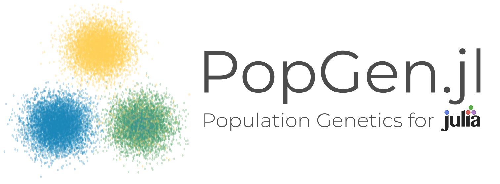

## What exactly that logo?

It's the Stepping Stone model of migration and population structure(!), arranged to resemble a double helix. Sorta looks like a fish, but that was unintentional. Clustering.jl already took the best logo idea we had:

No hard feelings though, because Clustering.jl is an **amazing** package :star2:!